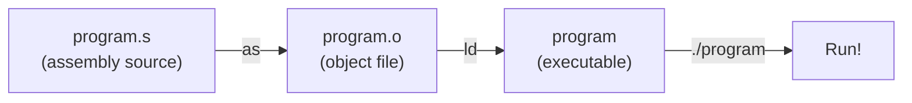

# Lesson 01 — Exit: Your First Program

## Goal

Write the absolute simplest ARM64 assembly program: one that does nothing
except exit cleanly.

## Build & run

```bash
make run
echo $?    # prints 0 — the exit code our program set
```

Try changing `#0` to `#42` in the source, rebuild, and run `echo $?` again.

## How your code becomes a runnable program

When you run `make`, two tools run in sequence:

### Step 1: The Assembler (`as`)

```bash
as -arch arm64 -o program.o program.s
```

The **assembler** reads your `.s` source file and translates each instruction
into its binary machine code equivalent. The output is an **object file**
(`.o`) — a file containing machine code, but not yet a runnable program. It
still has unresolved references (like "where does `_start` actually end up in
memory?").

### Step 2: The Linker (`ld`)

```bash
ld -arch arm64 -lSystem -syslibroot ... -e _start -o program program.o
```

The **linker** takes one or more object files and combines them into a final
executable binary. It:

1. **Resolves addresses** — figures out where each label will live in memory
2. **`-e _start`** — tells the linker which label is the entry point (where
   execution begins)
3. **`-lSystem`** — links against macOS's system library (needed so the OS
   knows how to load the program)
4. **`-o program`** — names the output file

The result is a **Mach-O executable** — the format macOS uses for programs.
You can now run it with `./program`.

### The full pipeline



The `Makefile` automates this so you just type `make`.

## New concepts

### What is assembly?

Assembly is a thin human-readable layer over **machine code** — the raw binary
instructions your CPU executes. Each assembly instruction maps (almost) 1-to-1
to a machine instruction. There is no runtime, no garbage collector, no
standard library. You talk directly to the hardware and the operating system
kernel.

### Reading an assembly file

Let's look at the entire program and break down every piece of syntax:

```asm
// program.s — Lesson 01: Exit

.global _start
.align 4

_start:
    mov     x0, #0
    mov     x16, #1
    svc     #0x80
```

There are four kinds of lines in an assembly file:

1. **Comments** — anything after `//` is ignored by the assembler (just like
   in C, JavaScript, or Swift). They're for humans only.
2. **Directives** — lines starting with a `.` (dot), like `.global` and
   `.align`. These are instructions to the **assembler tool**, not to the
   CPU. They control how the program is assembled but don't produce machine
   instructions.
3. **Labels** — names followed by a `:` (colon), like `_start:`. A label marks
   a location in the program. It's a name for a memory address. Think of it
   like a bookmark.
4. **Instructions** — like `mov` and `svc`. These are the actual operations
   the CPU will execute. Each one becomes a 4-byte machine instruction.

Blank lines and indentation don't matter — they're just for readability.
By convention, labels go at the left margin and instructions are indented.

### Directives: `.global` and `.align`

```asm
.global _start
```

`.global` tells the assembler: "make the label `_start` visible to the
outside world." Without this, the **linker** (the tool that turns your
assembled code into a runnable program) can't find your entry point and will
error.

```asm
.align 4
```

`.align 4` inserts padding bytes so the next thing starts at a memory address
divisible by 16 (2^4 = 16). ARM64 requires instructions to be aligned this
way. You'll put this near the top of your code and mostly forget about it.

### The entry point: `_start:`

Every program needs a place to begin. In C, that's `main()`. In a pure
assembly program, it's `_start`. The underscore is a convention inherited from
the C world — on macOS, all symbols get a leading underscore.

When you run `./program`, the operating system loads your code into memory and
jumps to whatever address `_start` points to. Execution proceeds from there,
one instruction at a time, top to bottom.

### Registers: the CPU's variables

Before we look at instructions, you need to understand **registers**.

A register is a tiny, fast storage slot **inside the CPU itself**. Think of
them as built-in variables that the processor can access instantly. Unlike
memory (RAM), which holds gigabytes but is relatively slow, registers are
extremely fast but there are only a few of them.

ARM64 has 31 general-purpose registers named **x0** through **x30**. Each one
holds a 64-bit value (a number up to about 18 quintillion). For this lesson,
we only use two:

| Register | What we use it for |
|----------|-------------------|
| `x0`    | The exit code (argument to the syscall) |
| `x16`   | The syscall number (tells the kernel what to do) |

### The `mov` instruction

```asm
mov     x0, #0
```

Let's read this piece by piece:

- **`mov`** — the instruction name. Short for "move." It copies a value into
  a register.
- **`x0`** — the **destination** register. Where the value goes. In ARM64,
  the destination is always the **first** operand.
- **`,`** — a comma separates the operands (the things the instruction
  operates on).
- **`#0`** — the **source** value. The `#` prefix means this is an
  **immediate** — a literal number written directly in the code, not a
  register or memory address. `#0` means "the number zero."

After this instruction executes, register `x0` contains the value `0`.

The second line works the same way:

```asm
mov     x16, #1
```

This puts the number `1` into register `x16`.

**The general pattern:** most ARM64 instructions follow this shape:
```
instruction   destination, source1 [, source2]
```

### System calls (syscalls)

Your program runs in **user space** — a restricted mode where it cannot
directly access hardware, write to the screen, or even exit. To do any of
these things, it must ask the **kernel** (the core of the operating system)
for help by making a **system call**.

On macOS ARM64, the protocol is:

1. Put the **syscall number** in register `x16`
2. Put the **arguments** in `x0`, `x1`, `x2`, ... (up to `x5`)
3. Execute the `svc` instruction to trap into the kernel

The kernel reads `x16`, looks up the corresponding function, calls it with the
arguments from `x0`–`x5`, and returns control to your program (unless the
syscall was `exit`, which never returns).

### The `svc` instruction

```asm
svc     #0x80
```

- **`svc`** — short for **Supervisor Call**. This is the instruction that
  transfers control from your program to the kernel.
- **`#0x80`** — the `0x` prefix means this number is in **hexadecimal**
  (base 16). `0x80` = 128 in decimal. This is the conventional trap number
  used on macOS. You'll always write `svc #0x80` — it never changes.

When `svc` executes, the CPU switches to kernel mode. The kernel inspects
`x16` to decide what you're asking for. In our case, `x16` = 1 = the `exit`
syscall.

### The `exit` syscall

| Syscall | Number | Arguments |
|---------|--------|-----------|
| `exit`  | 1      | `x0` = exit code |

An exit code of `0` means "success." Any nonzero value signals an error or
a specific status. This is the same convention used by every command-line
program — it's what `$?` shows in your shell after a command finishes.

### Putting it all together

```asm
mov     x0, #0      // Set the exit code to 0 (success)
mov     x16, #1     // Tell the kernel we want syscall #1 (exit)
svc     #0x80       // Transfer control to the kernel — program ends here
```

That's it. Three instructions. The kernel receives our request, terminates
the process, and reports exit code `0` to the shell.

## Exercises

1. Change the exit code to `42`, rebuild, and verify with `echo $?`
2. What happens if you remove the `.global _start` line? Try it and read the
   error message.
3. What happens if you remove the `svc` instruction? (Hint: the CPU will
   continue executing whatever bytes come next in memory.)

## What's next

This program exits, but it doesn't *do* anything visible. In the next lesson,
we'll make it print text to the terminal.
