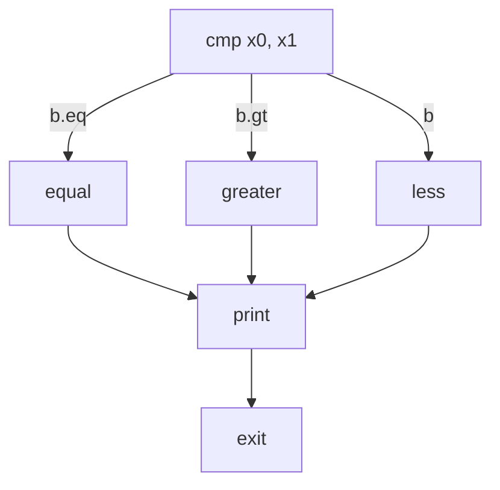

# Lesson 05 — Branching and Conditions

## Goal

Make our program take different paths based on a comparison. This is the
assembly equivalent of `if / else if / else`.

## Build & run

```bash
make run
# Output: First is greater.
```

Try changing the values of `x0` and `x1` in the source to get different
outputs.

## New concepts

### The condition flags (NZCV)

ARM64 has a special **PSTATE** register containing four condition flags that
arithmetic and comparison instructions can set:

| Flag | Name | Meaning |
|------|------|---------|
| **N** | Negative | Result was negative (bit 63 = 1) |
| **Z** | Zero | Result was zero |
| **C** | Carry | Unsigned overflow occurred |
| **V** | oVerflow | Signed overflow occurred |

Most arithmetic instructions (`add`, `sub`, etc.) do **not** set these flags
by default. To set them, you either use `cmp` or add an `s` suffix
(`adds`, `subs`).

### The `cmp` instruction

`cmp` is different from every instruction we've seen so far. With `add` or
`sub`, the first operand is always a destination register — the place where
the result is stored:

```asm
add     x2, x0, x1     // x2 = x0 + x1   (destination is x2)
sub     x3, x0, x1     // x3 = x0 - x1   (destination is x3)
```

`cmp` has **no destination register**. It takes exactly two operands — the
two values to compare — and nothing else:

```asm
cmp     x0, x1         // Compare x0 and x1 — that's it, no destination
```

So where does the result go? Nowhere visible. Internally, `cmp` subtracts
the second operand from the first (`x0 - x1`), but it **throws away the
numerical answer**. Instead, it records what happened in the CPU's internal
**condition flags** — invisible bits inside the processor that answer
questions like: was the result zero? Was it negative?

You cannot see these flags in any register. You cannot print them. They exist
solely so that the *next* branch instruction can check them and decide where
to jump. Think of `cmp` as asking a question ("how do these two values
compare?"), and the branch instruction that follows as acting on the answer
("jump here if they were equal").

Under the hood, `cmp x0, x1` is actually an alias for `subs xzr, x0, x1` —
it subtracts and sets the flags, but writes the result to the zero register
(`xzr`), which always reads as zero and silently discards anything written
to it.

After `cmp x0, x1`:
- If `x0 == x1`: the Z (Zero) flag is set, because the subtraction produced zero
- If `x0 > x1`:  N=0, Z=0 — the result was positive and nonzero
- If `x0 < x1`:  N=1 — the result was negative

### Conditional branches

After setting flags with `cmp`, use a conditional branch to act on the
result. The syntax is the letter `b` (for "branch"), then a **dot**, then a
**condition code suffix** that tells the CPU which flags to check:

```asm
b.eq    equal           // Branch to label "equal" if the Zero flag is set
b.gt    greater         // Branch to label "greater" if signed greater-than
```

Breaking down the syntax:
- `b` — the base instruction: "branch" (i.e., jump somewhere else)
- `.eq`, `.gt`, etc. — the **condition code** after the dot. This tells the
  CPU: "only jump if this condition is currently true in the flags"
- `equal`, `greater` — the **label name** to jump to (explained below)

The operand after the instruction is always a label name — it tells the CPU
*where* to jump if the condition is true. If the condition is false, the CPU
simply moves on to the next instruction as usual.

Here are the most common condition codes:

| Instruction | Condition | When true (after `cmp x0, x1`) |
|-------------|-----------|-------------------------------|
| `b.eq` | Equal | x0 == x1 |
| `b.ne` | Not equal | x0 != x1 |
| `b.gt` | Greater than (signed) | x0 > x1 |
| `b.ge` | Greater or equal (signed) | x0 >= x1 |
| `b.lt` | Less than (signed) | x0 < x1 |
| `b.le` | Less or equal (signed) | x0 <= x1 |
| `b.hi` | Higher (unsigned) | x0 > x1 (unsigned) |
| `b.lo` | Lower (unsigned) | x0 < x1 (unsigned) |

### Unconditional branch: `b`

```asm
b       label           // Always jump to label — no conditions checked
```

Plain `b` **without a dot or condition code** is an unconditional jump — like
`goto` in C. The CPU always jumps, no matter what the flags say. We use it
to skip over code blocks that shouldn't execute (the `else` branches) and to
converge different paths to a common exit point.

Notice the difference: `b.eq label` means "jump only if equal," while
`b label` means "jump no matter what."

### Labels as branch targets

You already know `_start:` from earlier lessons — it's a label that marks
where program execution begins. The labels in this lesson (`greater:`,
`less:`, `equal:`, `print:`) work exactly the same way: they mark positions
in the code. A label is just a name followed by a colon.

When the CPU "branches" to a label, it **jumps to that position** in the code
and continues executing from there, line by line. The label itself doesn't
generate any machine code — it's simply a bookmark that the assembler
translates into an address.

This is how assembly implements if/else logic: instead of nesting code inside
curly braces, you **jump over** the code blocks you don't want to run. In
our program:

```asm
    cmp     x0, x1
    b.eq    equal           // if equal, jump over "greater" and "less"
    b.gt    greater         // if greater, jump over "less"
    b       less            // otherwise, fall through to "less"

greater:                    // CPU lands here if x0 > x1
    // ... set up "greater" message ...
    b       print           // skip "less" and "equal", go straight to print

less:                       // CPU lands here if x0 < x1
    // ... set up "less" message ...
    b       print           // skip "equal", go straight to print

equal:                      // CPU lands here if x0 == x1
    // ... set up "equal" message ...
    b       print           // go to print

print:                      // All three paths converge here
    // ... print the message and exit ...
```

Without the `b print` at the end of each block, the CPU would "fall through"
into the next block and execute it too — there are no curly braces or `end`
markers in assembly. The unconditional `b` jumps are what keep the blocks
separate.

### Compare and branch on zero: `cbz` / `cbnz`

A handy shortcut for a common pattern:

```asm
cbz     x0, label       // Branch to label if x0 == 0
cbnz    x0, label       // Branch to label if x0 != 0
```

These combine the comparison and branch into one instruction and don't
modify the condition flags.

### Control flow structure

Our program's control flow looks like this:



Each branch prepares its message and then jumps to the common `print` label.
This is the assembly equivalent of:

```c
if (a == b)      printf("equal\n");
else if (a > b)  printf("greater\n");
else             printf("less\n");
```

### How `b` (branch) works internally

The `b` instruction encodes a **PC-relative offset** — it says "jump forward
(or backward) N instructions from here." The assembler calculates this offset
from the label automatically. The range is +/- 128 MB, which is plenty for
almost any function.

## Exercises

1. Set both values to `42`. Verify the "equal" message prints.
2. Add a fourth case: if the difference between the two numbers is exactly 1,
   print "They are close." (Hint: after `cmp`, check with `b.eq`, then
   subtract and compare the result to 1.)
3. Use `cmp x0, #10` to compare against an immediate value instead of a
   register.
4. Replace `b.gt` with `b.hi`. What's the difference? Test with
   `mov x0, #-1` (which is a very large unsigned number).

## What's next

Branching lets us make decisions, but many programs need to do things
repeatedly. In the next lesson, we'll learn to write loops.
