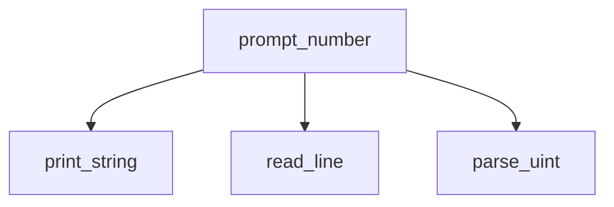
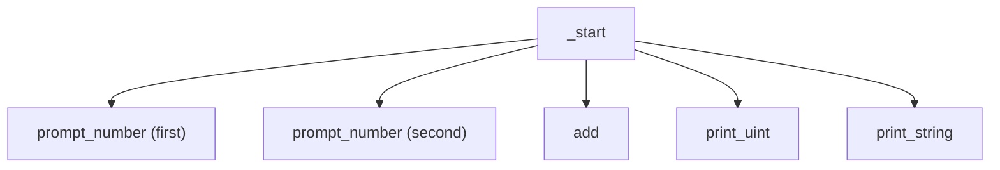

# Lesson 11 — Calculator: Adding Two Numbers

## Goal

Combine everything from the previous 10 lessons to build an interactive
program that reads two numbers, adds them, and prints the result.

## Build & run

```bash
make run
# Enter first number:  123
# Enter second number: 456
# 123 + 456 = 579
```

Or: `printf "123\n456\n" | ./program`

## New concepts

### Composing functions

This lesson introduces no new instructions. Instead, it demonstrates how to
**compose** the functions we've built across the previous lessons:





This is how real programs are structured — small, focused functions composed
into larger operations.

### Line-buffered reading

In lesson 09, we used a simple `read(0, buf, 128)` that read up to 128 bytes
at once. This works interactively (the terminal sends one line at a time) but
fails with piped input, where all data is available immediately.

Our improved `read_line` reads **one byte at a time** until it finds a newline:

```asm
.Lrl_loop:
    // read(stdin, buffer + offset, 1)
    mov     x0, #0
    add     x1, x19, x20       // current position in buffer
    mov     x2, #1              // one byte at a time
    mov     x16, #3
    svc     #0x80

    // Check for newline
    ldrb    w0, [x19, x20]
    add     x20, x20, #1
    cmp     w0, #0x0A           // '\n'?
    b.ne    .Lrl_loop
```

This is slower (one syscall per byte) but correct in all cases. Real programs
use buffered I/O to get both correctness and performance.

### The callee-save discipline in practice

This lesson is where register discipline matters most. Consider the call chain:

```
_start stores first number in x19
  └── calls prompt_number (second time)
       └── calls read_line
            └── which also uses x19 internally
```

If `read_line` didn't save and restore `x19`, the first number would be lost.
Every function that uses callee-saved registers (`x19`–`x28`) must save them
on entry and restore them on exit.

Notice how the bug manifests silently — you get wrong results, not a crash.
This makes register discipline bugs some of the hardest to find in assembly.

### Building output dynamically

Instead of pre-formatting a string like `"123 + 456 = 579"`, we print each
piece separately:

```asm
print_uint(x19)         // "123"
print_string(" + ")     // " + "
print_uint(x20)         // "456"
print_string(" = ")     // " = "
print_uint(x19 + x20)   // "579"
print_newline()          // "\n"
```

This is more flexible — it works for any numbers without knowing their widths
in advance.

## Exercises

1. Add subtraction, multiplication, and division. Let the user choose the
   operation by entering `+`, `-`, `*`, or `/` (read a single character).
2. Handle the case where the user enters `0` as the second number when
   dividing (print an error message instead of dividing).
3. Make the program loop — after printing the result, ask for two more
   numbers. Exit when the user enters `0` for both numbers.
4. Add support for negative numbers (handle a leading `'-'`).

## What's next

In the final lesson, we'll learn to read and write files using system calls —
opening files, reading their contents, and writing output to files.
